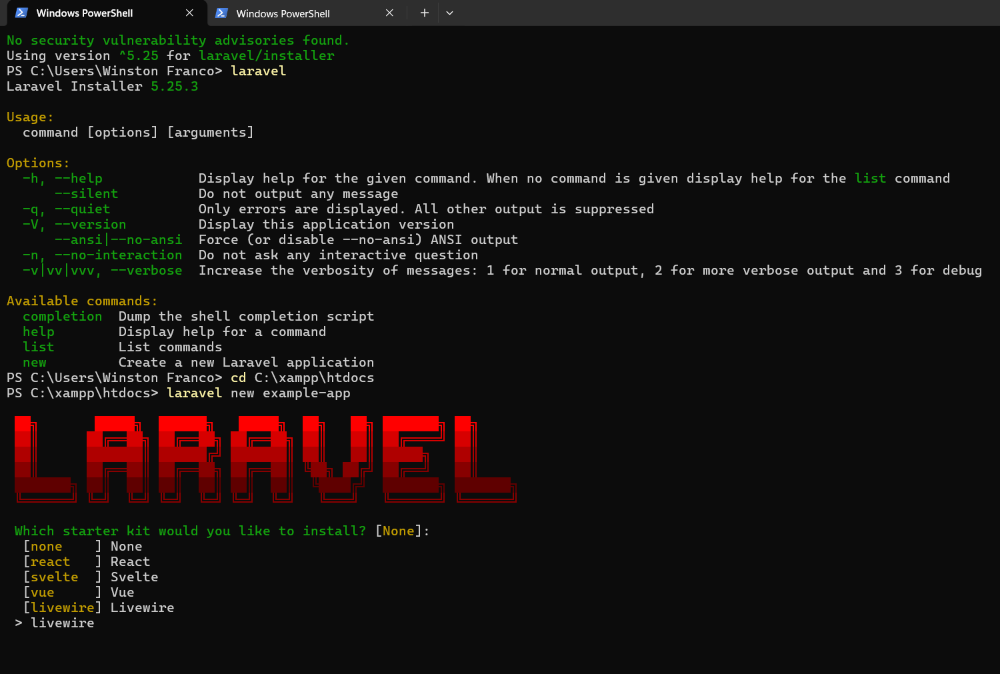
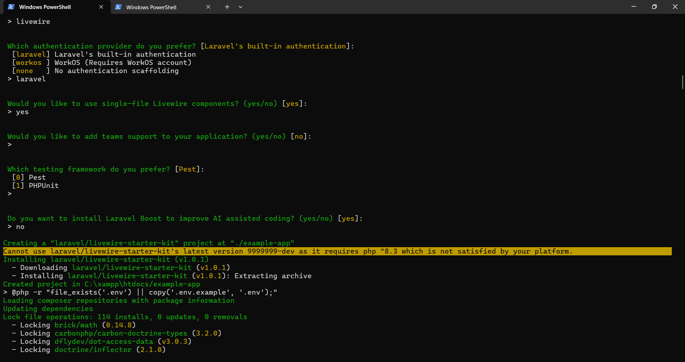
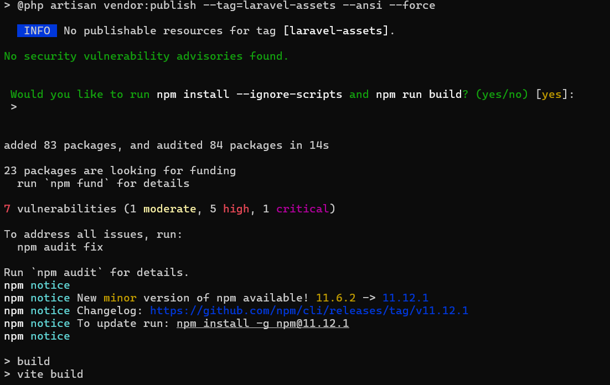
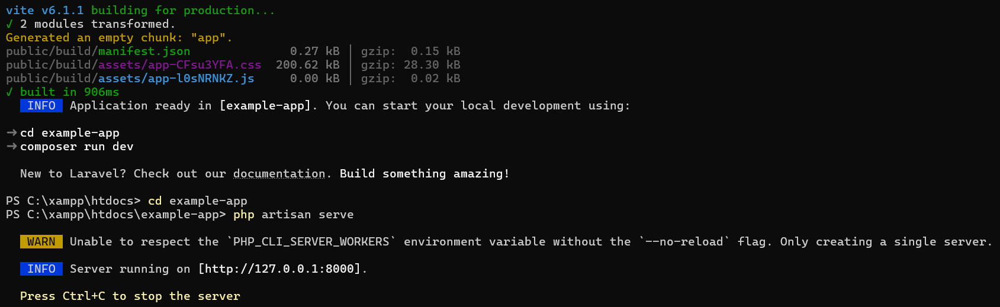
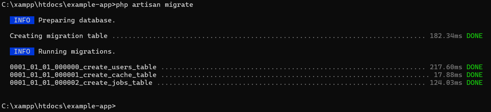
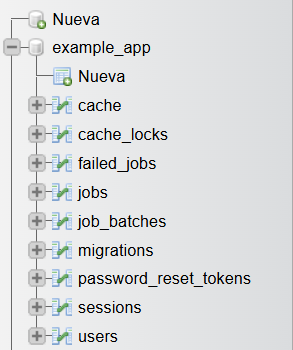

# 🧪 Laboratorio #2 - Implementación de Login en Laravel

Este repositorio contiene **la ejecucióny resultado de la ejecución de Laravel** 
🔹Comprender la importancia de la documentación en proyectos de desarrollo de
software.
🔹Consolidar el aprendizaje de la arquitectura Modelo-Vista-Controlador (MVC) en
Laravel.
🔹Evidenciar el proceso de configuración e implementación del módulo de login en
Laravel.
🔹Identificar las dificultades encontradas durante el laboratorio y las soluciones
aplicadas

## 📖 Introducción

El objetivo de este laboratorio es comprender el funcionamiento del patrón MVC en Laravel mediante la implementación de un sistema de autenticación.

Laravel permite estructurar el proyecto de la siguiente forma:

- 🧠 **Modelo (Model):** Maneja la lógica de datos y la base de datos.
- 🎨 **Vista (View):** Representa la interfaz de usuario.
- ⚙️ **Controlador (Controller):** Gestiona la lógica de la aplicación.
- 🌐 **Rutas (Routes):** Definen las URL del sistema.
---
## ⚙️ Requisitos Previos

Para ejecutar este proyecto se requiere:

- PHP 8.2 o superior  
- Composer (última versión)  
- Laravel Installer  
- XAMPP (Apache y MySQL)  
- Base de datos MySQL  
- Node.js y npm  
- Visual Studio Code  
- Sistema Operativo: Windows  

### 🌐 Tecnologías utilizadas

 
 
 
 
 
 

---

## 🚀 Instalación del Proyecto

Para la creación del proyecto se utilizó
Primeramente, se abrió la terminal del sistema (CMD) y se ejecutaron los siguientes comandos:
```bash
composer global require laravel/installer
```
Este comando permite instalar el instalador global de Laravel, el cual facilita la creación de nuevos proyectos.
Luego, se accedió a la carpeta del servidor local proporcionado por XAMPP:
```bash
cd C:\xampp\htdocs
```
Esta ruta corresponde al directorio donde se almacenan los proyectos web en el entorno local.
Finalmente, se creó el proyecto Laravel con el siguiente comando:
```bash
laravel new example-app
```
En este caso, el proyecto fue nombrado example-app, el cual contiene toda la estructura base de Laravel junto con el sistema de autenticación.
Durante el proceso de instalación, **se seleccionaron las siguientes opciones:**

🔹 Starter kit: Livewire
🔹 Autenticación: Laravel
🔹 Componentes: Single-file
🔹 Soporte de equipos: No
🔹 Testing: Pest
Esto permitió generar automáticamente una aplicación con funcionalidades de login, registro y dashboard

## Evidencias de comandos
### Comandos de instalación y selección de ruta


### Creación de laravel project


### Dependencias


### Ejecución del servidor Laravel


## Base de Datos

Para este laboratorio se utilizó el gestor de base de datos MySQL mediante el entorno de desarrollo local XAMPP.

### ⚙️ Configuración del archivo .env

Laravel utiliza el archivo `.env` para configurar la conexión a la base de datos:

```env
DB_CONNECTION=mysql
DB_HOST=127.0.0.1
DB_PORT=3306
DB_DATABASE=example_app
DB_USERNAME=root
DB_PASSWORD=
```
Este archivo permite definir los parámetros necesarios para la conexión con la base de datos.

## Migraciones
Laravel utiliza migraciones para crear y gestionar la estructura de la base de datos.
El siguiente código corresponde a la migración de la tabla users:
Schema::create('users', function (Blueprint $table) {
    $table->id();
    $table->string('name');
    $table->string('email')->unique();
    $table->timestamp('email_verified_at')->nullable();
    $table->string('password');
    $table->rememberToken();
    $table->timestamps();
});
Además, se crean otras tablas importantes como:
- password_reset_tokens
- sessions

## Comandos utilizados
Para crear las tablas en la base de datos se ejecutó el siguiente comando:
```env
php artisan migrate
```
Este comando ejecuta todas las migraciones y crea las tablas necesarias en la base de datos.


## Evidencia de la base de datos
Respaldo de la base de datos
Se realizó un respaldo (backup) de la base de datos exportándola desde phpMyAdmin en formato .sql, el cual se incluye en el repositorio.
Este respaldo permite restaurar la base de datos en caso de ser necesario.



